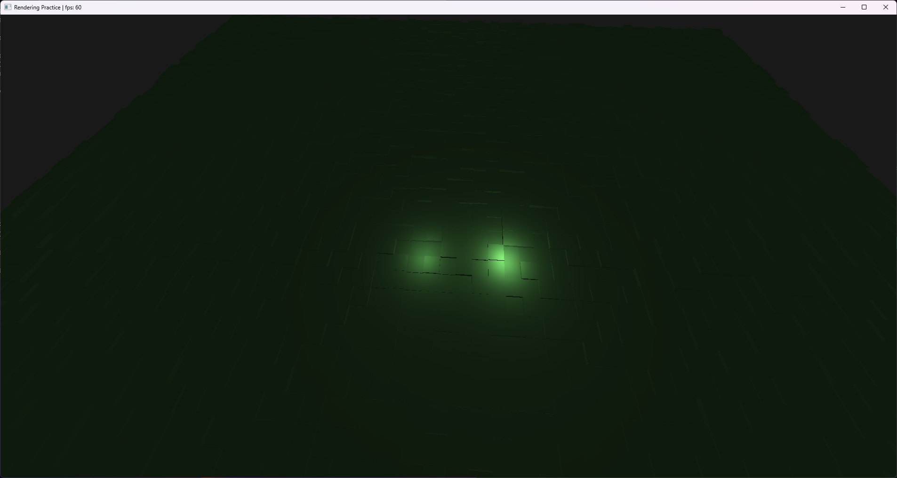

# Overview
This is a simple cube rendering engine built from the ground up in C using OpenGL. The goal was to practice doing 3d graphics math for to control a camera around a simple cube world scene (very small scene). It also implements some basic phong lighting and adds an extra multisample pass for anti-aliasing.

## Build
This project doesn't have any dependencies that aren't typically on a standard windows install. To build the program, you need the msvc compiler for now, but supporting other compilers is fairly trivial at this point. Just *cd* to the project root directory and call *build.bat*. You need the msvc environment variable non-sense, so edit the command below to your *vcvarsall.bat* path.

```
call "C:\Program Files\Microsoft Visual Studio\2022\Community\VC\Auxiliary\Build\vcvarsall.bat" x64 && build.bat
```

## Running the Program
There should be *render_demo.exe* in the build folder. Go into that folder and run it. There are some extra files there because this program supports hot reloading. While running the program, if you call *build.bat* again, the program will automatically reload the *render_demo.dll* and update the changes.
### Controls
- Move with WASD
- Look with Arrow Keys
- 

